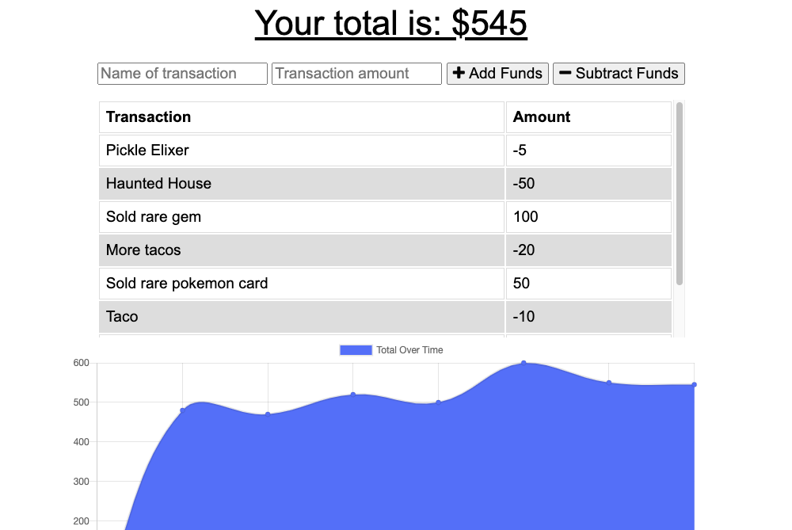
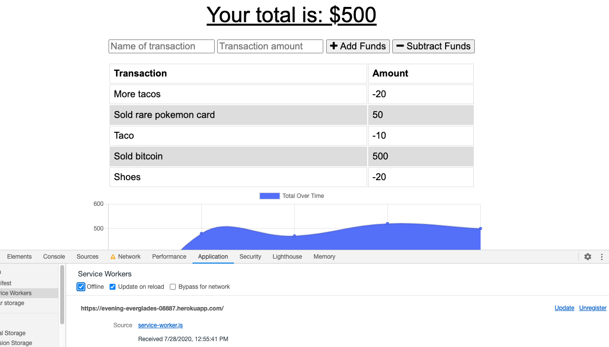

# PWA Budget Tracker Homework 18

### Overview
Giving users a fast and easy way to track their money is important, but allowing them to access that information anytime is even more important. Having offline functionality is paramount to our applications success.

# Node Express Handlebars Links

[Link to GitHub Repo](https://github.com/jenniferdaeumler/gt-pwa-budgettracker-hw-18)
[Link to deployed Heroku site](https://evening-everglades-08887.herokuapp.com/)

## Description
With this app, the user will be able to add expenses and deposits to their budget with or without a connection. When entering transactions offline, they should populate the total when brought back online.  I added functionality to the existing Budget Tracker application to allow for offline access and functionality.

## Table of Contents

1. [Installation](#installation)
2. [Usage](#usage)
3. [Credits](#credits)
4. [MIT License](#mit-license)
5. [Contributing](#contributing)

## Installation
Use the Heroku link to display the app in your browser. 

## Usage
Add description of expense or deposit transaction along with dollar amount.  Watch the total and chart adjust accordingly. 

Demonstrating offline capabilities. 

## Credits

Solo projected completed as homework for Georgia Tech Full-Stack Flex Program.
Trilogy Education provided assets.

## MIT-License

Copyright (c) [2020][jennifer daeumler]

Permission is hereby granted, free of charge, to any person obtaining a copy
of this software and associated documentation files (the "Software"), to deal
in the Software without restriction, including without limitation the rights
to use, copy, modify, merge, publish, distribute, sublicense, and/or sell
copies of the Software, and to permit persons to whom the Software is
furnished to do so, subject to the following conditions:

The above copyright notice and this permission notice shall be included in all
copies or substantial portions of the Software.

THE SOFTWARE IS PROVIDED "AS IS", WITHOUT WARRANTY OF ANY KIND, EXPRESS OR
IMPLIED, INCLUDING BUT NOT LIMITED TO THE WARRANTIES OF MERCHANTABILITY,
FITNESS FOR A PARTICULAR PURPOSE AND NONINFRINGEMENT. IN NO EVENT SHALL THE
AUTHORS OR COPYRIGHT HOLDERS BE LIABLE FOR ANY CLAIM, DAMAGES OR OTHER
LIABILITY, WHETHER IN AN ACTION OF CONTRACT, TORT OR OTHERWISE, ARISING FROM,
OUT OF OR IN CONNECTION WITH THE SOFTWARE OR THE USE OR OTHER DEALINGS IN THE
SOFTWARE.

## Contributing

If you created an application or package and would like other developers to contribute it, you will want to add guidelines for how to do so. The [Contributor Covenant](https://www.contributor-covenant.org/) is an industry standard, but you can always write your own.
